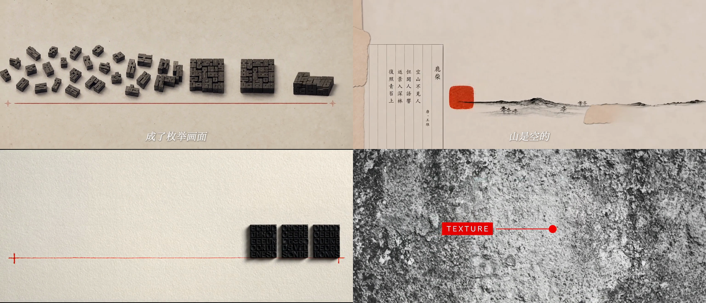

# Archival Fragments（简版）

「档案剪贴」视觉风格 + **参考图 → 首尾帧**的做法。

满幅象牙纸、单色印刷黑白、单一暗砖红。先出一串**各不相同**的参考图，
再用相邻两张作为首尾帧生成镜头——因为相邻两镜共用同一张图，接点严丝合缝。



## 这个包固定什么

只固定两件事：**风格**，和**方法**。

不绑定模型、不装依赖、不代跑流程。你用什么图片模型、什么视频工具都行。

## 对工具的唯一要求

| 环节 | 要求 |
|---|---|
| 图片 | 能出你要的比例（推荐 4:3），文字渲染较准 |
| 视频 | **必须支持首尾帧**——也叫「首尾帧」「first & last frame」「start/end frame」「frames to video」 |

不支持首尾帧的纯文生视频工具做不了这套方法，镜与镜之间必然跳变。

## 三步做法

1. **拆镜** —— 把文案按句拆成镜头，设计一条连续的视觉旅程，列出 N+1 张参考图
2. **出参考图** —— 文生图，一张一个提示词，出完逐张审
3. **生成镜头** —— 每镜挂两张图（第 N 张作首帧、第 N+1 张作尾帧），提示词只写运动

## 三条硬约束

**1. 每一镜的参考图必须不同。** N 个镜头需要 N+1 张各不相同的参考图。
"相邻两镜共用同一张图"指的是第 1 镜尾帧 = 第 2 镜首帧这**一个接点**，不是整片共用一张图。
拿同一张结构图当所有镜头的参考——真实发生过，结果几十个镜头画面一模一样。

**2. 具象优先。** 纸和红线是画面的地面，不是主体。每句话找一个观众不用想就懂的通用符号
（世界地图+图钉、天平、台阶、一大堆实物），全片收敛到 2–3 个。抽象几何图形观众看不懂。

**3. 慢不等于静。** 每一镜结尾画面必须和开头明显不同。

## 目录

```
archival-fragments-lite/
├── SKILL.md          入口：三条硬约束 + 三步做法 + 工具要求
├── README.md         本文件
├── CHANGELOG.md
├── metadata.json
├── references/
│   ├── style.md        视觉基线：色板、红色的四种职责、技术标注词汇
│   ├── keyframes.md    参考图链设计、风格前缀、图片提示词、文字规则
│   └── shots.md        首尾帧运动句写法、动词表、变速
├── examples/         一条 67.3s / 34 镜成片的提示词原文
│   ├── keyframes.json  35 张参考图提示词
│   └── shots.json      34 条运动句
└── assets/
    ├── style-reference.png       风格参考板（只给人看，不要当生成输入）
    └── example-01..08-*.jpg      八张连续参考图，看画面怎么一张张推进
```

## 和完整版的区别

| | 简版（本包） | [archival-fragments](../archival-fragments/) |
|---|---|---|
| 工具 | 任意，只要支持首尾帧 | LibTV CLI + MiniMax H3 + Fish Audio |
| 流程 | 只给方法，你自己跑 | 环境检查 → 写文案 → 配音 → 生成 → 拼片，全流程 |
| 适合 | 大多数人 | 已经在用那套工具链的人 |

拿不准就用简版。

## 授权与来源

MIT。`assets/` 里的图片由 AI 生成，仅作风格示例。
风格分析对象为 MiniMax 公开发布片，本包不含其任何素材。
