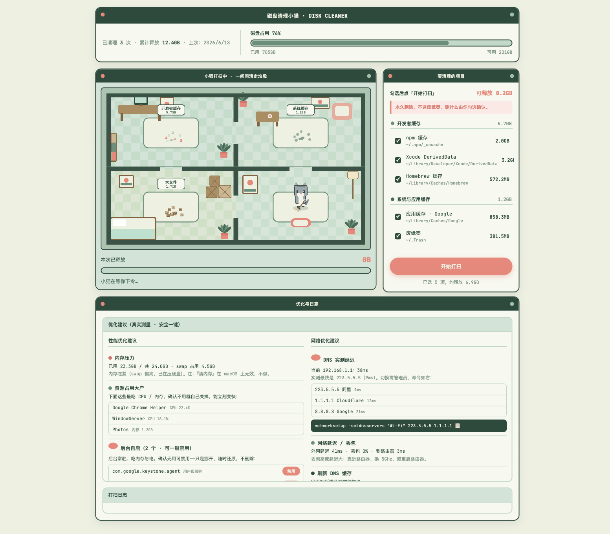

# 磁盘清理小猫 🐱（yyl-disk-cleaner-cat）

一个有**持续记忆**、带**像素风交互页**（Quiet Place 薄荷绿 + 蓝白小猫）的 macOS 磁盘清理 / 空间 & 性能优化 skill。
扫描 → 像素页确认 → 一只蓝白小猫在一张**手绘像素公寓俯视图**（`web/room.png`）里、沿固定路线**穿门进房间一间间清走垃圾**（走门洞、被墙和家具遮挡，不穿墙）→ 把这次清理写进记忆，下次更懂你。



## 它做什么

- **扫描 5 个板块**：开发者缓存、系统与应用缓存、大文件与下载、性能优化、网络优化。
- **像素页确认**：缓存这类安全项学会后自动预勾选；大文件永远要你亲手勾。永久删除会醒目提示。
- **手绘像素公寓动画**（背景 = `web/room.png` 俯视图）：公寓分四间——办公室（开发缓存）/ 客厅（下载文件）/ 机房（系统缓存）/ 卧室（大文件），办公室角落的圆窝是小猫起点/终点。每间**家具前的地面**一处不同外观的垃圾堆（缓存碎片 / 灰尘团 / 纸箱 / 木箱）+ 实时剩余大小小标签；确认后小猫从猫窝出发，**沿确认好的固定路线走门洞进各房间打扫**——穿门用三张与原图等尺寸的透明墙图层（`room1-2/2-3/2-4.png`）整张盖到最顶层实现，门框像素级精准；垃圾随真实删除进度缩小、扫完那间变「✓ 干净」并冒星星，最后原路返回猫窝。两栏工具式布局：左边房间动画，右边磁盘 + 清理清单，下面优化建议与日志。
  - **模拟预览**：网址后加 `?demo=1`（如 `http://127.0.0.1:8765/?demo=1`）进入安全模拟——假数据 + 假删除，只看小猫走房间的动画，不碰任何真实文件。不带参数就是正式版（真实扫描 + 真实删除）。
- **性能/网络：真实测量 + 安全一键**：内存看 swap、列 CPU/内存大户、实测 DNS 延迟并推荐；后台自启可一键禁用/还原（用户级、挪开可还原）；sudo 类只给命令。清内存/一键加速这类无效操作不做。
- **持续记忆**：每次清了什么、你的偏好都记在 `~/.disk-cleanup-cat/`，跨会话交接。

## 怎么用

对 Claude 说「**清理一下磁盘**」「**电脑变慢了帮我优化**」「**磁盘满了**」即可触发。

Claude 会启动小猫、扫描、弹出像素页；你在页面上勾选确认、点「开始打扫」，看小猫干活；完事 Claude 给你总结。

## 结构

```
yyl-disk-cleaner-cat/
├── SKILL.md            # 给 Claude 的运行说明
├── src/
│   ├── engine.py       # 扫描 / 永久删除（带安全守卫）/ 记忆
│   └── server.py       # 本地桥梁服务：起服务、SSE 推进度、自动开浏览器
├── web/                # 像素风交互页（房间 + 会打扫的小猫 + 确认 UI）
│   ├── index.html  ·  style.css  ·  app.js      # 走路打扫版（?demo=1 进安全模拟）
│   ├── room.png                                 # 手绘像素公寓俯视图（背景）
│   └── room1-2 / 2-3 / 2-4.png                  # 三道门的透明墙图层（盖顶层做穿门遮挡）
├── references/
│   └── categories.md   # 每个板块扫什么、删什么、安全性
└── assets/             # 预览图
```

## 记忆位置

`~/.disk-cleanup-cat/`：`MEMORY.md`（人读概览）、`preferences.json`（偏好+学习）、`history.jsonl`（每次清理记录）。

## 要求 & 边界

- **仅 macOS**，依赖系统自带 `python3`（零额外安装）。
- 删除是**永久删除、不进废纸篓**，但永远需要你在页面上确认；引擎只删缓存白名单和你亲手勾的大文件。
- 不自动跑 `sudo`，性能/网络的系统级操作只给命令、由你手动执行。
