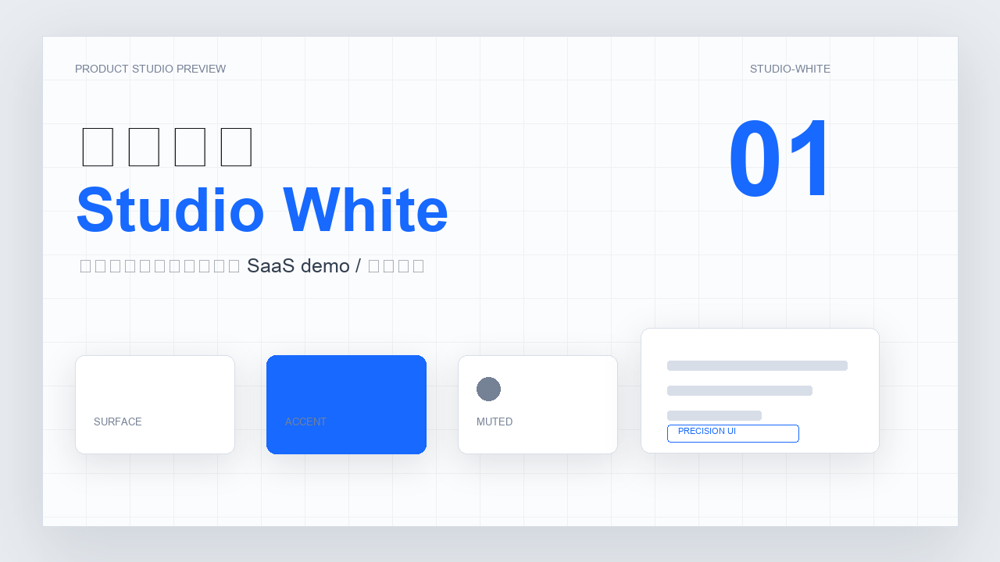
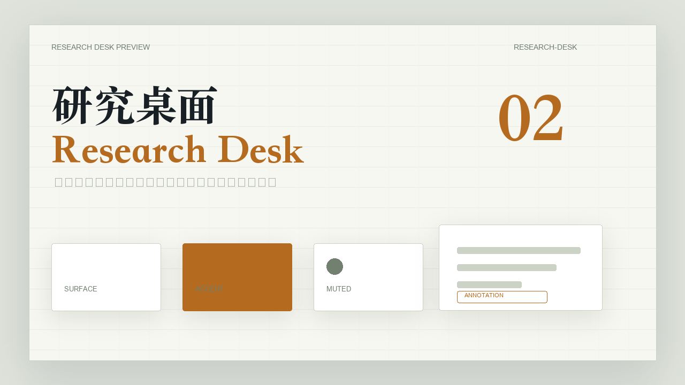

# YYL Remotion Video


[English README](./README.en.md)

一个适配 Claude Code / Codex 等本地 Agent 环境的 Remotion 视频技能，用于把文章、口播稿、资料摘要或明确大纲制作成 **16:9、逐帧可控、可直接渲染 mp4 的视频项目**。

它专注 Remotion，不做点击驱动网页演示，也不在流程内合成语音。视频时长由 Agent 根据口播文本和画面复杂度估算，后期配音、字幕和混音可以在剪辑软件里完成。

内置 3 套主题：

- **command-film / 命令行电影**：电影感命令室，适合 Agent、终端、自动化、开发者工具。
- **studio-white / 白棚发布**：干净白棚产品感，适合 SaaS demo、课程、产品发布。
- **research-desk / 研究桌面**：纸面研究桌，适合报告、论文、长文和知识型视频。

内置 1 个可复制模板：

- **luxury-perspective-gallery**：深色高端作品集 3D 横向画廊，适合 portfolio、产品 showcase、agency 风格动画。

## 30 秒开始

### 一行命令安装（推荐）

```bash
npx skills@latest add ttfake92-lab/skills
```

然后在交互列表里选择 `yyl-remotion-video`。

### 仅安装当前 skill 到项目

```bash
SKILL_BASE_URL=https://github.com/ttfake92-lab/skills/tree/main npx skill skills/yyl-remotion-video
```

也可以直接把这段话发给有 shell 权限的 AI Agent：

```text
帮我安装 yyl-remotion-video。请执行 npx skills@latest add ttfake92-lab/skills，在列表里选择 yyl-remotion-video，安装完成后检查 SKILL.md、references/、themes/ 是否存在。
```

已经安装过的话，用这段话更新：

```text
帮我更新 yyl-remotion-video。请重新执行 npx skills@latest add ttfake92-lab/skills，并选择 yyl-remotion-video。
```

安装后可以这样触发：

```text
用 yyl-remotion-video 把这段口播做成 Remotion 视频，使用 command-film 主题，先渲染检查帧，再导出 mp4。
```

## 效果预览

**studio-white / 白棚发布**



**research-desk / 研究桌面**



## 适合 / 不适合

**适合：**

- 需要直接导出 mp4 的短视频、讲解视频、发布视频
- 终端 / 代码 / UI / 数据流等逐帧可控动画
- 后期统一配音的视频片段
- 主题驱动的 16:9 横屏视频模板

**不适合：**

- 点击推进、浏览器录屏式的网页演示
- 需要在 skill 流程内自动合成语音的任务
- 只有一个主题、没有口播稿 / 原文 / 大纲的完整选题创作

## 工作流

1. **输入判断**：用户需提供原文、口播稿、资料摘要或明确大纲。只有主题时先补素材。
2. **执行强度**：Agent 根据内容长度和风险选择 Quick / Standard / Strict。
3. **内容落盘**：整理 `article.md`、`script.md`、`outline.md`、`notes.md`。
4. **Remotion 项目**：复用已有 `remotion/`；缺失时用 `npx create-video@latest --blank --no-tailwind remotion` 创建。
5. **主题选择**：只使用本 skill 的 `command-film`、`studio-white`、`research-desk`。
6. **模板选择**：需要特定画面机制时读取 `references/TEMPLATES.md`，例如 `luxury-perspective-gallery`。
7. **逐帧实现**：用 `useCurrentFrame()`、`interpolate()`、`Easing`、`Sequence`，不使用 CSS animation / transition / GSAP 驱动主动画。
8. **验证交付**：先 `npm run lint`，再渲染 still 检查帧，确认后导出 mp4。

## 目录结构

```text
yyl-remotion-video/
├── SKILL.md
├── README.md
├── README.en.md
├── agents/openai.yaml
├── references/
│   ├── REMOTION-CRAFT.md
│   ├── THEMES.md
│   └── TEMPLATES.md
├── templates/
│   └── luxury-perspective-gallery/
├── themes/
│   ├── command-film/
│   ├── studio-white/
│   └── research-desk/
└── previews/
    ├── studio-white.png
    └── research-desk.png
```

## 平台支持

| 平台 | 状态 | 说明 |
|------|------|------|
| Claude Code | 支持 | 原生 Skill 工作流，适合本地生成和渲染 Remotion 项目 |
| Codex | 支持 | 适合实现、检查帧、渲染 mp4、调试 TypeScript |
| Cursor / 其他本地 Agent | 可用 | 需要能读写文件并执行 shell 命令 |
| 普通 Chatbot | 不推荐 | 没有文件系统和 Remotion 渲染环境时无法稳定交付 |

## License

MIT. See the repository license.
